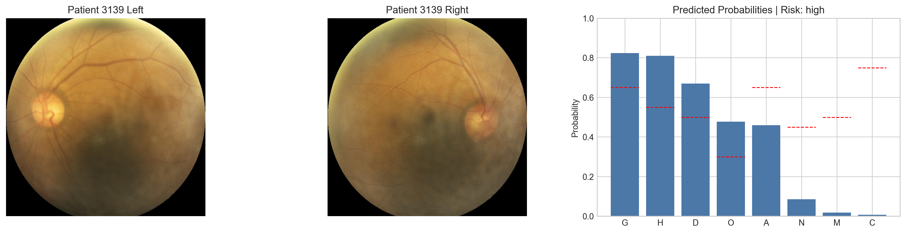
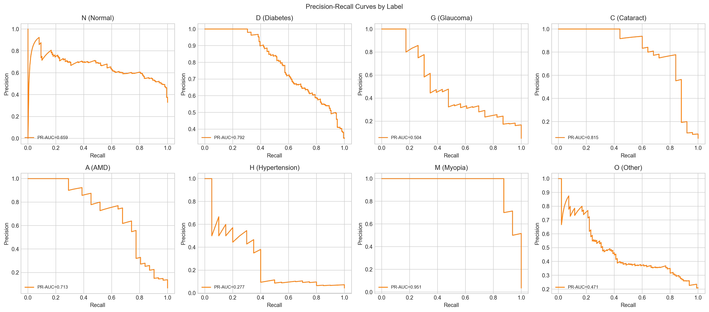
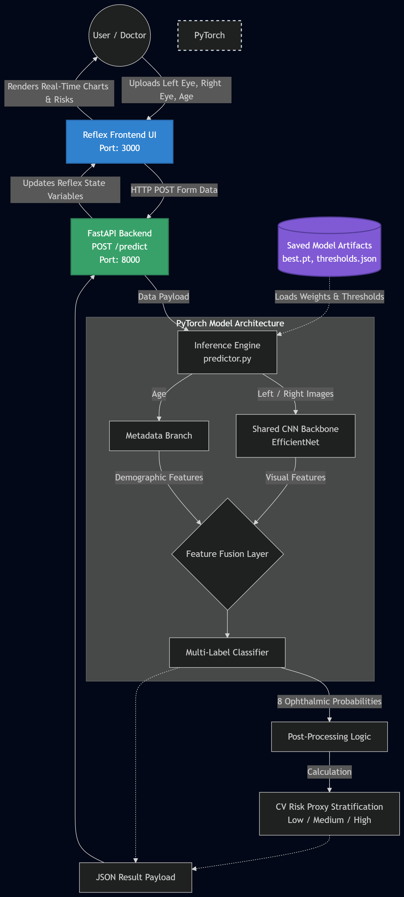

# Eye-Heart Connection

End-to-end multimodal AI system for cardiovascular-risk-oriented retinal screening.
The model consumes:
- Left fundus image
- Right fundus image
- Patient age

It predicts 8 ophthalmic indicators and derives an interpretable cardiovascular (CV) risk proxy summary (`low`, `medium`, `high`).


TRY IT OUT - [EYE_HEART_CONNECTION](https://huggingface.co/spaces/ayushsainime/eye_heart_connect_reflex_app)

Demo - 
![working_video]https://huggingface.co/datasets/ayushsainime/eye_heart_connect_media/resolve/main/eye_heart_video_demo.mp4


"deployment only" code available on the "deploy" branch . 

## Highlights

- Bilateral retinal modeling (left + right eye) with age fusion
- 8-label multi-label prediction
- CV proxy post-processing for clinically meaningful risk banding
- Production-ready inference API with FastAPI
- Reflex UI with modern layout, charting, and guided patient flow
- Dockerized Hugging Face Spaces deployment

## Labels Predicted

- `N` Normal
- `D` Diabetes
- `G` Glaucoma
- `C` Cataract
- `A` AMD
- `H` Hypertension
- `M` Myopia
- `O` Other

## Model Performance

### Training and Validation Metrics


### Patient Prediction Metrics


### Precision-Recall Curves


### ROC Curves by Labels


## System Architecture

1. Left and right fundus images are encoded via a shared CNN backbone (EfficientNet-B4 based pipeline).
2. Age is processed through a metadata branch.
3. Visual and metadata features are fused for 8-label multi-label prediction.
4. Predicted probabilities are transformed into CV proxy components and a final risk band.

ACHITECTURE DIAGRAM - 



## Tech Stack

### ML and Data
- PyTorch
- Torchvision
- Albumentations
- OpenCV
- NumPy
- Pandas
- scikit-learn
- Matplotlib
- TensorBoard

### Backend and Serving
- FastAPI
- Uvicorn
- Pydantic
- python-multipart
- HTTPX

### Frontend
- Reflex (Radix UI + Recharts)

### Packaging and Deployment
- Docker
- Hugging Face Spaces

## Challenges We Faced

### Deployment Platform Journey

Deploying this multimodal AI system came with its fair share of challenges. We went through multiple deployment platforms before finding the right fit:

1. **Railway** - Our initial deployment attempt. While Railway is great for general web applications, we encountered limitations with resource constraints and build times for ML models with heavy dependencies.

2. **Render** - We then switched to Render, hoping for better ML support. However, we faced similar issues with memory limits and cold start times that affected the user experience.

3. **Hugging Face Spaces** - Finally, we found our home! Hugging Face Spaces turned out to be the ideal choice for several reasons:
   - **Built for AI/ML**: Native support for ML models with GPU options
   - **Generous free tier**: Adequate resources for inference workloads
   - **Docker support**: Easy containerization and deployment
   - **Community visibility**: Better discoverability for AI projects
   - **Seamless model integration**: Direct integration with Hugging Face models and transformers ecosystem
   - **Persistent storage**: Useful for caching model weights and artifacts

### Frontend Evolution

The frontend also went through iterations:

- **Gradio** - We started with Gradio for quick prototyping. It's excellent for ML demos and getting something working fast. However, as our vision for the app grew, we found Gradio's customization options limiting for creating a polished, professional user experience.

- **Reflex** - We made the switch to Reflex (formerly Pynecone) for a more modern, flexible frontend. Reflex gave us:
  - Full control over UI components with Radix UI
  - Interactive charts with Recharts integration
  - A guided patient flow experience
  - Professional, production-ready aesthetics
  - Pure Python development (no need to write JavaScript)

The journey from Gradio to Reflex transformed our app from a simple ML demo into a polished healthcare screening tool.

## Repository Structure

```text
api/                    FastAPI inference API
artifacts/              Runtime artifacts (best.pt, thresholds, metadata stats)
assets/                 Frontend static assets (animation, css, sample_cases)
configs/                API/model/data/inference/train configuration files
datasets/               Dataset preparation and loaders
evaluation/             Evaluation scripts and reports
inference/              Predictor and inference logic
models/                 Model definitions
reflex_app/             Reflex frontend application
tests/                  Test suite
training/               Training pipeline
utils/                  Shared utilities (config, logging, etc.)
```

## Local Setup

### 1) Create environment and install dependencies

```bash
python -m pip install --upgrade pip
python -m pip install -e .
python -m pip install -e ".[frontend,dev]"
```

## Run Locally

### Reflex UI + Inference API

Terminal 1 (API):

```bash
uvicorn api.main:app --host 127.0.0.1 --port 8000
```

Terminal 2 (Reflex):

```bash
reflex run
```

Open: `http://localhost:3000`

Notes:
- Reflex config is in `rxconfig.py` (frontend `3000`, Reflex backend `8001`).
- Reflex frontend calls inference API at `http://localhost:8000`.

## API Reference

### Endpoints

- `GET /health`
- `POST /predict`

### `POST /predict` form fields

- `left_image`: file
- `right_image`: file
- `age`: float

### Example cURL

```bash
curl -X POST "http://127.0.0.1:8000/predict" \
  -F "left_image=@assets/sample_cases/1_left.jpg" \
  -F "right_image=@assets/sample_cases/1_right.jpg" \
  -F "age=55"
```

## Hugging Face Spaces Deployment (Docker)

This repo is ready for Hugging Face Spaces Docker deployment.

### Runtime artifacts required in `artifacts/`

- `best.pt`
- `metadata_stats.json`
- `thresholds.json`

### Container runtime behavior

- Starts FastAPI inference API on internal `:8000`
- Starts Reflex frontend on public `${PORT}` (default fallback `7860`)
- Uses the Docker entrypoint script included in the repository root.

### Hugging Face Spaces setup steps

1. Create a new Space on Hugging Face and choose **Docker** as the SDK.
2. Push this repository to the Space.
3. Hugging Face will detect the `Dockerfile` and build automatically.
4. In the Space settings, add environment variables if needed:
- `PORT=7860`
- `API_CONFIG_PATH=configs/api_space.yaml`
- Optional override: `EHC_API_BASE=http://localhost:8000`
5. Deploy and watch logs until both FastAPI and Reflex services start.

### Recommended post-deploy checks

1. Open your Hugging Face Space URL.
2. Confirm home page loads (Reflex UI).
3. Upload sample images and run one prediction.
4. Confirm `/predict` flow returns results in UI.

## Training and Evaluation

### Train

```bash
python -m training.train --config configs/train.yaml --data-config configs/data.yaml --model-config configs/model.yaml
```

### Evaluate

```bash
python -m evaluation.run --config configs/eval.yaml --data-config configs/data.yaml --model-config configs/model.yaml --ckpt experiments/latest/best.pt
```

## Important Notes

- This project is designed as a research and screening aid.
- Outputs are predictive signals, not clinical diagnoses.
- External validation and clinical oversight are required for real-world medical use.

## Disclaimer

This repository is for research and educational use only. It is not a certified medical device and must not be used as a standalone basis for clinical decision-making.
